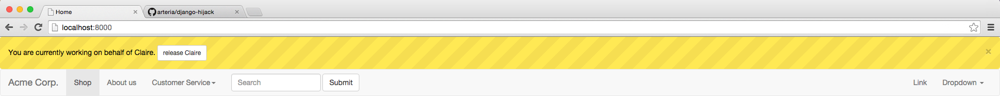

# Django Hijack

With Django Hijack, admins can log in and work on behalf of other users without having to know their credentials.

## Docs
See http://django-hijack.readthedocs.org/en/stable/.

## Testimonials

> I am using django-hijack on a project with hundreds of users, wonderful tool for support. Thank you!
>
> -- [benzinonapoloni](https://www.reddit.com/user/benzinonapoloni) on [reddit](https://redd.it/39aggd)

> This is a super useful tool. I have a site where I occasionally impersonating users to help troubleshoot their issues. This is a huge time saver.
>
> -- [orangishyellow](https://www.reddit.com/user/orangishyellow) on [reddit](https://redd.it/2i35fu)

> ... one of our standard apps to install now.
>
> -- [thundersnow](https://www.reddit.com/user/thundersnow) on [reddit](https://redd.it/4wqo0d/)

> Love django-hijack
>
> -- [bmihelac](https://twitter.com/bmihelac) on [Twitter](https://twitter.com/bmihelac/status/836225081508519936)

| django-hijack is free software. If you find it useful and would like to give back, please consider to make a donation using [Bitcoin](https://blockchain.info/payment_request?address=1AJkbQdcNkrHzxi91mB1kkPxh4t4BJ4hu4) or [PayPal](https://www.paypal.me/arteriagmbh). Thank you! |
| ----- |
