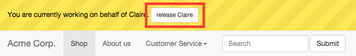
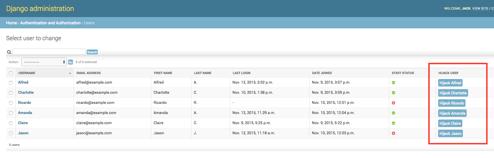

*With Django Hijack, admins can log in and work on behalf of other users without having to know their credentials. <https://github.com/arteria/django-hijack/>*

# Installation

Get the latest stable release from PyPi:

    pip install django-hijack

In your ``settings.py``, add ``hijack`` and the dependency `compat` to your installed apps:

```python
INSTALLED_APPS = (
    ...,
    'hijack',
    'compat',
)
```

Finally, add the Django Hijack URLs to ``urls.py``:

```python
urlpatterns = [
    ...
    url(r'^hijack/', include('hijack.urls')),
]
```

## After installing

### Setting up redirections
You should specify a `HIJACK_LOGIN_REDIRECT_URL` and a `HIJACK_LOGOUT_REDIRECT_URL`. 
This is where admins are redirected to after hijacking or releasing a user. 
Both settings default to `LOGIN_REDIRECT_URL`.

```python
# settings.py
HIJACK_LOGIN_REDIRECT_URL = '/profile/'  # Where admins are redirected to after hijacking a user
HIJACK_LOGOUT_REDIRECT_URL = '/admin/auth/user/'  # Where admins are redirected to after releasing a user
```

### Setting up the notification bar
We strongly recommend displaying a notification bar to everyone who is hijacking another user.
This reduces the risk of an admin hijacking someone inadvertently or forgetting to release the user afterwards.

To set up the notification bar, add the following lines to your `base.html` or to another template in which you want the notification bar to be displayed.

```html
<!-- At the top -->



...

<!-- In the head -->
<link rel="stylesheet" type="text/css" href="" />

...

<!-- Directly after <body> -->


...
```

If your project uses Bootstrap you may want to set `HIJACK_USE_BOOTSTRAP = True` in your project settings.
Django Hijack will display a Bootstrap notification bar that does not overlap with the default navbar.

### Generic template filter
We also provide a generic template filter to check if you are currently hijacking a user. This is useful for displaying/hiding elements besides the notification bar.

```html


...

```

# Usage

Superusers can hijack a user by by sending a POST request to a `/hijack/...` URL.

The following URLs are available by default:

* `/hijack/<user id>` 
* `/hijack/username/<username>`
* `/hijack/email/<user email>`

If the hijacking is successful, the user is redirected to the `HIJACK_LOGIN_REDIRECT_URL`, 
and the yellow notification bar is displayed at the top of the landing page.

Here is a reference implementation of a button that allows a superuser to hijack the user referenced by the context variable `user`:

```html
<form action="/hijack/{{ user.id }}/" method="post">
    
    <button type="submit">Hijack {{ user.username }}</button>
</form>
```

## Ending the hijack
In order to end the hijack and switch back to your admin account, push the "Release" button in the yellow notification bar:



As an alternative, send a POST request to `/hijack/release-hijack/`.

After releasing, you are redirected to the `HIJACK_LOGOUT_REDIRECT_URL`.

## Django admin integration

If you want to display the hijack button in the Django admin's user list which is usually located at `/admin/auth/user/`, 
have a look at the <https://github.com/arteria/django-hijack-admin> app 
that was originally a part of the core and has since been moved to a separate app.

Example screenshot:



## Signals
You can catch a signal when someone is hijacked or released. Here is an example:

```python
from hijack.signals import hijack_started, hijack_ended

def print_hijack_started(sender, hijacker_id, hijacked_id, request, **kwargs):
    print('%d has hijacked %d' % (hijacker_id, hijacked_id))
hijack_started.connect(print_hijack_started)
    
def print_hijack_ended(sender, hijacker_id, hijacked_id, request, *kwargs):
    print('%d has released %d' % (hijacker_id, hijacked_id))
hijack_ended.connect(print_hijack_ended)
```
