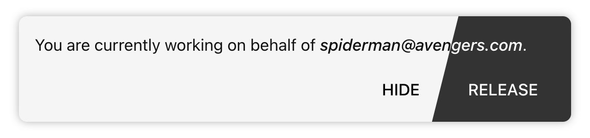

# Django-Hijack

_Log in and work on behalf of other users without having to know their credentials._



* easy integration
* custom user model support
* customizable & secure
* automatic dark-mode theme

## Installation

Get the latest stable release from PyPi:

    pip install django-hijack

Add ``hijack`` to your installed apps and the hijack middleware:

```python
# settings.py
INSTALLED_APPS = [
    '…',
    'hijack',
]

MIDDLEWARE = [
    '…',
    'hijack.middleware.HijackUserMiddleware',
]
```

Finally, add the Django Hijack URLs:

```python
# urls.py
from django.urls import include, path


urlpatterns = [
    path('hijack/', include('hijack.urls')),
    # …
]
```

## Usage

### Hijacking another user

The following example shows how to integrate a hijack button into your template.

```html

<html>
<body>
{# … #}

<form action="" method="POST">
  
  <input type="hidden" name="user_pk" value="{{ another_user.pk }}">
  <button type="submit">hijack {{ another_user }}</button>
  <input type="hidden" name="next" value="{{ request.path }}">
</form>

{# … #}
</body>
</html>
```

A form is used to perform a POST including a [CSRF][CSRF]-token for security reasons.
The field `user_pk` is mandatory and the value must be set to the target users' primary
key. The optional field `next` determines where a user is forwarded after a successful hijack. 
If not provided, users are forwarded to the [LOGIN_REDIRECT_URL][LOGIN_REDIRECT_URL].

Do not forget to load the `hijack` template tags to use the `can_hijack` filter.
The `can_hijack` returns a boolean value, the first argument should be user hijacker,
the second value should be the hijacked.

[CSRF]: https://docs.djangoproject.com/en/stable/ref/csrf/
[LOGIN_REDIRECT_URL]: https://docs.djangoproject.com/en/stable/ref/settings/#login-redirect-url


### Django admin integration

If you want to display the hijack button in the Django admin's user list, you can simply
add `hijack.contrib.admin` to your `INSTALLED_APPS` setting.

Example screenshot:


You may also add the button to other models, that have a foreign relation to the user
model.

```python
# admin.py
from django.contrib import admin
from hijack.contrib.admin import HijackUserAdminMixin

from . import models

@admin.register(models.Post)
class PostAdmin(HijackUserAdminMixin, admin.ModelAdmin):
    def get_hijack_user(self, obj):
        return obj.author  # or any other attribute that points to a user
```
